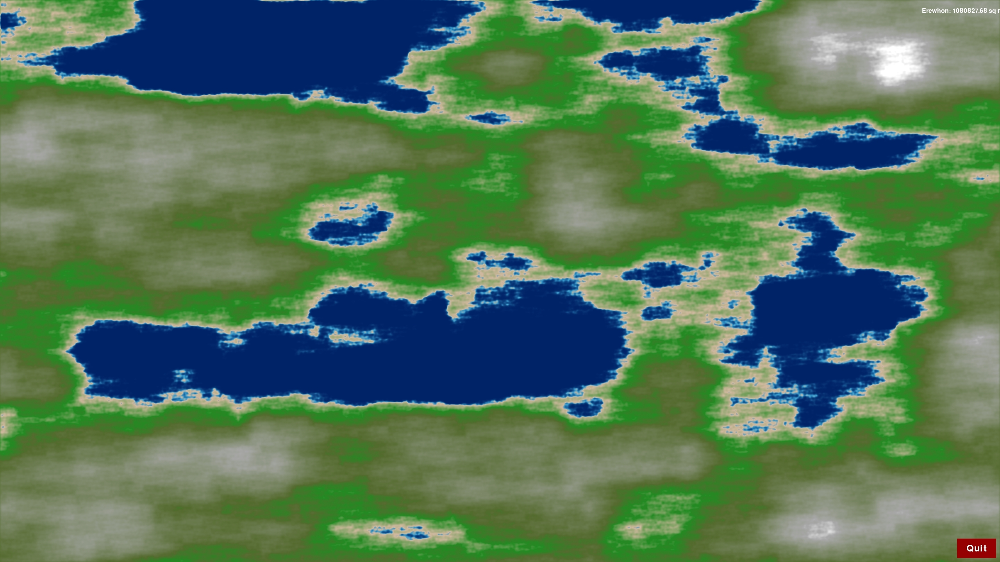

# Procedural World Generator

## Overview

This project is a procedural world generator built using Python and Pygame, with heavy utilization of libraries such as NumPy, SciPy, and PyTorch. The application generates procedural worlds with labeled continents rendered with various terrain types such as deep water, shallow water, grasslands, forests, mountains, and snow.

## Features

- Procedural generation of world maps using Perlin noise.
- Rendering using Pygame.
- [WIP] Inclusion of geological and hydraulic erosion processes.
- [WIP] Ability to label and highlight continents.

## Screenshot



## Installation

### Prerequisites

- Python 3.7+
- PIP (Python package installer)

### Steps

```sh
# Clone the repository
git clone https://github.com/AlrikOlson/worldmap-generator

# Navigate to the project directory
cd worldmap-generator

# Install the required dependencies
pip install -r requirements.txt
```

## Usage

### Using Command Line

Simply run the main script to start the procedural world generator.

```sh
python src/main.py
```

### Using VS Code

1. **Open the Project**: Open the project folder in VS Code.

2. **Install Extensions**:
   - Install the Python extension for VS Code.
  
3. **Run the Project**:
   - Open the Run and Debug side panel (using the play icon on the sidebar or `Ctrl+Shift+D`).
   - Select the configuration "Python: Debug Map Generator".
   - Click the green play button or press `F5` to start debugging.

### Controls

- **Spacebar**: Generate a new random world.
- **Quit Button**: Click to exit the application.

## Project Structure

The project is organized into several packages:

- **core**: Contains the primary logic for the game, world generation, rendering, and continent labeling.
- **procedural**: Contains modules for generating procedural terrain using Perlin noise, and applying geological and erosion processes.
- **ui**: Contains UI components like buttons.
- **utils**: Contains utility classes for device management, random seed management, and progress updates.

Here's an overview of notable files and directories:

```
project-directory/
│
├── src/
│   ├── core/
│   │   ├── game.py                # Main game loop and event handling
│   │   ├── world.py               # World data structure
│   │   ├── world_generator.py     # World generation logic
│   │   ├── world_renderer.py      # Renders the world using Pygame
│   │   └── continent_labeler.py   # Labels continents in the world
│   │
│   ├── procedural/
│   │   ├── erosion.py             # Applies hydraulic erosion to the world
│   │   ├── geological.py          # Adds geological features to the world
│   │   ├── map_generator.py       # Main procedural generation pipeline
│   │   └── perlin_noise.py        # Generates Perlin noise for terrain
│   │
│   ├── ui/
│   │   └── button.py              # Button UI element
│   │
│   ├── utils/
│   │   ├── device_manager.py      # Manages computing devices (CPU/GPU)
│   │   ├── filter.py              # Applies Gaussian filter to smooth terrain
│   │   ├── progress_callback.py   # Utility for progress updates
│   │   └── random_manager.py      # Manages random seed for reproducibility
│   │
│   ├── main.py                    # Program entry point
│   ├── __init__.py                
│
├── requirements.txt               # Project dependencies
└── README.md                      # Project documentation
```

## Dependencies

- `pygame`: For rendering and window management.
- `numpy`: For numerical operations.
- `torch`: For computational operations (supports CUDA and MPS).
- `scipy`: For labeling contiguous regions (used in continent labeling).

Install all dependencies using:
```sh
pip install -r requirements.txt
```

## Customization

### Adjusting Map Generation Parameters

You can customize various parameters in the procedural generation logic:

- **scale**: Affects the zoom level of the noise map.
- **octaves**: Controls the number of layers of Perlin noise.
- **persistence** and **lacunarity**: Modify the amplitude and frequency of octaves.
- **erosion settings**: Located in the erosion and geological modules.

### Changing Colors

To adjust the colors of different terrain types, modify the color constants in the world renderer.

## Disclaimer

This project was heavily assisted by AI language models, specifically OpenAI's GPT-4 Omni and Claude 3 Opus by Anthropic. These models were utilized to generate significant portions of the codebase as well as the project documentation.